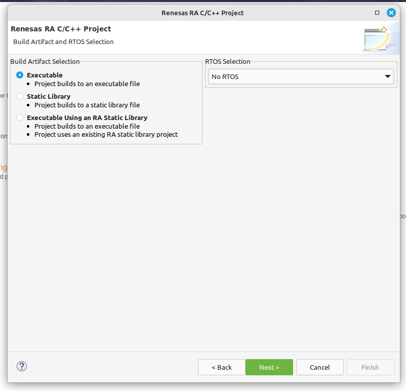
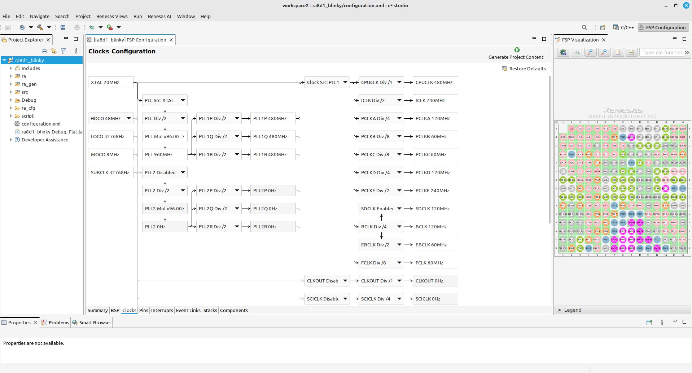
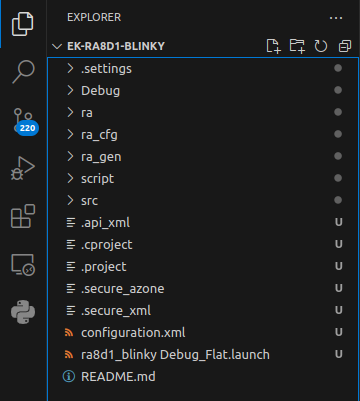
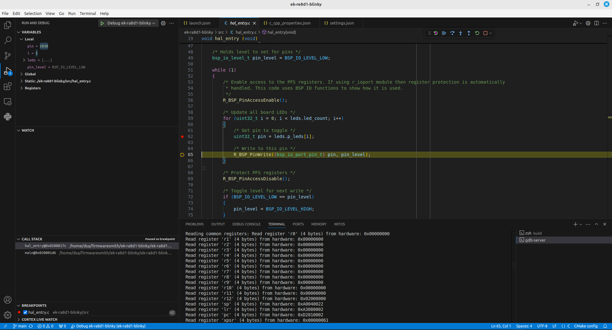

+++
author = "Firmwaresm1th"
title = "RA8D1 Blinky"
date = "2024-11-30"
description = "RA8D1 Evaluation board - from unboxing to blinking LEDs and working debug config"
tags = [
    "ra8d1",
    "fromzerotomain",
]
categories = [
    "ra8d1-series",
]
image = "images/ra8d1-ek.jpg"
+++

This article covers running the first LED blink application on the RA8D1-EK evaluation board
and refactoring the project structure to better suit individual needs.

Code is available on this [Github repo](https://github.com/firmwaresmith/ek-ra8d1-blinky)

## Generating code with Renesas E2 Studio

While I am definitely not a fan of Eclipse-based manufacturer IDEs, Renesas E2 Studio feels refreshingly good. It's quite fast (compared to other Eclipse-based manufacturer IDEs), and the MCU configuration widgeCode cleanup and reorganizationustZone project or a non-secure project, as well as the type of build artifact you need - whether it's a bare-metal project or one based on an RTOS.



The clock selection tool looks really clear.



The project builds without any issues.

```sh
Extracting support files...
13:00:48 **** Build of configuration Debug for project ra8d1_blinky ****
make -r -j8 all
Building file: ../src/hal_entry.c
Building file: ../ra_gen/common_data.c
Building file: ../ra_gen/hal_data.c
Building file: ../ra_gen/main.c
Building file: ../ra_gen/pin_data.c
Building file: ../ra_gen/vector_data.c
Building file: ../ra/fsp/src/bsp/mcu/all/bsp_clocks.c
Building file: ../ra/fsp/src/r_ioport/r_ioport.c
Building file: ../ra/fsp/src/bsp/mcu/all/bsp_common.c
Building file: ../ra/fsp/src/bsp/mcu/all/bsp_delay.c
Building file: ../ra/fsp/src/bsp/mcu/all/bsp_group_irq.c
Building file: ../ra/fsp/src/bsp/mcu/all/bsp_guard.c
Building file: ../ra/fsp/src/bsp/mcu/all/bsp_io.c
Building file: ../ra/fsp/src/bsp/mcu/all/bsp_irq.c
Building file: ../ra/fsp/src/bsp/mcu/all/bsp_macl.c
Building file: ../ra/fsp/src/bsp/mcu/all/bsp_register_protection.c
Building file: ../ra/fsp/src/bsp/mcu/all/bsp_rom_registers.c
Building file: ../ra/fsp/src/bsp/mcu/all/bsp_sbrk.c
Building file: ../ra/fsp/src/bsp/mcu/all/bsp_sdram.c
Building file: ../ra/fsp/src/bsp/mcu/all/bsp_security.c
Building file: ../ra/fsp/src/bsp/cmsis/Device/RENESAS/Source/startup.c
Building file: ../ra/fsp/src/bsp/cmsis/Device/RENESAS/Source/system.c
Building file: ../ra/board/ra8d1_ek/board_init.c
Building file: ../ra/board/ra8d1_ek/board_leds.c
Building target: ra8d1_blinky.elf
arm-none-eabi-objcopy -O srec "ra8d1_blinky.elf"  "ra8d1_blinky.srec"
arm-none-eabi-size --format=berkeley "ra8d1_blinky.elf"
   text	   data	    bss	    dec	    hex	filename
   5016	      8	   1192	   6216	   1848	ra8d1_blinky.elf

13:00:49 Build Finished. 0 errors, 0 warnings. (took 1s.330ms)
```

## Code Cleanup and Structure Optimization

Now it's time to clean up the project structure, which seems to be designed for non-programmers.
We'll start from the ground up with our own project organization.
First, let's initialize a new Git repository to track changes,
then move the entire project into this new repository.
This will allow us to address all issues in the following steps.



Not bad, not terrible. There could be even more IDE-related, XML-based,
and not very human-readable files scattered around, but fortunately,
they are all located in the root directory and the `.settings` folder.
Before making the first commit, let's add the build directories to the `.gitignore`
file to ensure they won't be included in the repository.

```gitignore
# Build directories (one from E2 Studio IDE, other one choosed by me)
Debug/
build/
```

In the next steps:
- remove all IDE-related files
- move all directories containing header and source files into the `ek-ra8d1-blinky` directory,
  following a structure similar to that used in Python libraries.

## Extracting Build Flags

Let's extract the build flags from the compile command file. I chose a single file, `startup.c`, to analyze the build flags.

In VSCode, you can select an empty space in a JSON snippet,
press `Ctrl+Shift+L`, and then use the `Left Arrow` key followed by `Enter` to split a long line into multiple shorter ones.
However, I assume there are smarter ways to accomplish this.
If you know of one, feel free to leave a suggestion in the GitHub Issues section of this repository.

```json
[
  {
    "command":
      "arm-none-eabi-gcc
      -mthumb
      -mfloat-abi=hard
      -mcpu=cortex-m85+nopacbti
      -O2
      -fmessage-length=0
      -fsigned-char
      -ffunction-sections
      -fdata-sections
      -fno-strict-aliasing
      -Wunused
      -Wuninitialized
      -Wall
      -Wextra
      -Wmissing-declarations
      -Wconversion
      -Wpointer-arith
      -Wshadow
      -Wlogical-op
      -Waggregate-return
      -Wfloat-equal
      -g
      -D_RENESAS_RA_
      -D_RA_CORE=CM85
      -D_RA_ORDINAL=1
      -I\"/home/dsa/e2_studio/workspace2/ra8d1_blinky/src\"
      -I\".\"
      -I\"/home/dsa/e2_studio/workspace2/ra8d1_blinky/ra/fsp/inc\"
      -I\"/home/dsa/e2_studio/workspace2/ra8d1_blinky/ra/fsp/inc/api\"
      -I\"/home/dsa/e2_studio/workspace2/ra8d1_blinky/ra/fsp/inc/instances\"
      -I\"/home/dsa/e2_studio/workspace2/ra8d1_blinky/ra/arm/CMSIS_6/CMSIS/Core/Include\"
      -I\"/home/dsa/e2_studio/workspace2/ra8d1_blinky/ra_gen\"
      -I\"/home/dsa/e2_studio/workspace2/ra8d1_blinky/ra_cfg/fsp_cfg/bsp\"
      -I\"/home/dsa/e2_studio/workspace2/ra8d1_blinky/ra_cfg/fsp_cfg\"
      -std=c99
      -Wno-stringop-overflow
      -Wno-format-truncation
      -flax-vector-conversions
      --param=min-pagesize=0
      -c
      -o
      \"/home/dsa/e2_studio/workspace2/ra8d1_blinky/Debug/ra/fsp/src/bsp/cmsis/Device/RENESAS/Source/startup.o\"
      -x
      c
      \"/home/dsa/e2_studio/workspace2/ra8d1_blinky/ra/fsp/src/bsp/cmsis/Device/RENESAS/Source/startup.c\"",
  }
]
```

There are ABI flags - these are essential for ensuring the code runs correctly on this platform.
We will include them in our configuration.
```
  -mthumb
  -mfloat-abi=hard
  -mcpu=cortex-m85+nopacbti
```

Optimization flags - we will change this flag to `-Og` to make our application easier to debug.
```
  -O2
```

The warning flags seem to be used rather frivolously.
On one hand, they included some useful flags like `-Wfloat-equal` to improve code sanity,
but on the other hand, they disabled critical checks with `-Wno-stringop-overflow`
instead of properly addressing string manipulation issues in their code.
I will replace this inconsistent setup with a cleaner
and more robust approach: `-Wall -Wextra -Werror`, a standard,
balanced set of warnings choosed by the GCC compiler authors.
```
      -Wunused
      -Wuninitialized
      -Wall
      -Wextra
      -Wmissing-declarations
      -Wconversion
      -Wpointer-arith
      -Wshadow
      -Wlogical-op
      -Waggregate-return
      -Wfloat-equal
      -Wno-stringop-overflow
      -Wno-format-truncation
```

Debug options - we will change this to `-g2` to include more debug symbols.
```
 -g
```

Preprocessor definitions - before copying them I will surely search through code if they are used
```
  -D_RENESAS_RA_
  -D_RA_CORE=CM85
  -D_RA_ORDINAL=1
```

Include search paths - we will copy only those that are actually used.
There is no need to include the root directory, as it should not contain any header or source files.
Using include paths relative to the root directory is considered a poor stylistic choice.
```
  -I\"/home/dsa/e2_studio/workspace2/ra8d1_blinky/src\"
  -I\".\"
  -I\"/home/dsa/e2_studio/workspace2/ra8d1_blinky/ra/fsp/inc\"
  -I\"/home/dsa/e2_studio/workspace2/ra8d1_blinky/ra/fsp/inc/api\"
  -I\"/home/dsa/e2_studio/workspace2/ra8d1_blinky/ra/fsp/inc/instances\"
  -I\"/home/dsa/e2_studio/workspace2/ra8d1_blinky/ra/arm/CMSIS_6/CMSIS/Core/Include\"
  -I\"/home/dsa/e2_studio/workspace2/ra8d1_blinky/ra_gen\"
  -I\"/home/dsa/e2_studio/workspace2/ra8d1_blinky/ra_cfg/fsp_cfg/bsp\"
  -I\"/home/dsa/e2_studio/workspace2/ra8d1_blinky/ra_cfg/fsp_cfg\"
```

Dialect option - we will not use this in our code.
I don’t understand why so many people fix their code's build dialect to C99 or another older standard instead of allowing it to fall back to the compiler's default, which I believe is generally very reasonable.
I would only use a fixed dialect for external libraries that specifically require it.
Otherwise, why limit yourself to C99? Not that there are many new features in C17,
given that it’s a very conservative language, but it still seems unnecessary to impose such limitations.
```
  -std=c99
```

Other flags:
```
  -fmessage-length=0
  -fsigned-char
  -ffunction-sections
  -fdata-sections
  -fno-strict-aliasing
  -flax-vector-conversions
  --param=min-pagesize=0
```

The first option, `-fmessage-length`, controls the maximum line length of compiler error messages. We don’t need this.

The flags `-ffunction-sections` and `-fdata-sections` split the contents of object files into separate sections, making it easier for the linker to garbage collect unused functions and data.

We should probably retain `-fno-strict-aliasing`, `-fsigned-char`, and `--param=min-pagesize=0` to avoid potential issues with code that depends on these options. However, we could consider dropping `-flax-vector-conversions`, as this flag seems to only prevent compile-time errors when code relies on implicit vector type conversions, which we may not need.

## Basic CMake script

Now let's add a basic CMake configuration, starting with the CMake toolchain file.

```CMake
# cmake/toolchains/arm-none-eabi-gcc.cmake file

# MCU type
set(CMAKE_SYSTEM_NAME Generic)
set(CMAKE_SYSTEM_PROCESSOR arm)

# Compiler executables to be searched
set(CMAKE_C_COMPILER arm-none-eabi-gcc)
set(CMAKE_CXX_COMPILER arm-none-eabi-g++)

# Other executables shipped with toolchain
set(CMAKE_OBJCOPY arm-none-eabi-objcopy)
set(CMAKE_SIZE_UTIL arm-none-eabi-size)

# Stop CMake from trying build executable test, without setting some flags it will fail
set(CMAKE_TRY_COMPILE_TARGET_TYPE STATIC_LIBRARY)
```

Experts in other build systems might call this unnecessary CMake bloat,
but I find it quite clear - we're simply instructing CMake on how to locate our toolchain in the system PATH.

Additionally, we can target a specific version of the compiler by modifying the `CMAKE_C_COMPILER` value like this:
`set(CMAKE_C_COMPILER arm-none-eabi-gcc-13.3.1)`.

Let's extract the list of source files from the Renesas E2 Studio build log.

```sh
Building file: ../src/hal_entry.c
Building file: ../ra_gen/common_data.c
Building file: ../ra_gen/hal_data.c
Building file: ../ra_gen/main.c
Building file: ../ra_gen/pin_data.c
Building file: ../ra_gen/vector_data.c
Building file: ../ra/fsp/src/bsp/mcu/all/bsp_clocks.c
Building file: ../ra/fsp/src/r_ioport/r_ioport.c
Building file: ../ra/fsp/src/bsp/mcu/all/bsp_common.c
Building file: ../ra/fsp/src/bsp/mcu/all/bsp_delay.c
Building file: ../ra/fsp/src/bsp/mcu/all/bsp_group_irq.c
Building file: ../ra/fsp/src/bsp/mcu/all/bsp_guard.c
Building file: ../ra/fsp/src/bsp/mcu/all/bsp_io.c
Building file: ../ra/fsp/src/bsp/mcu/all/bsp_irq.c
Building file: ../ra/fsp/src/bsp/mcu/all/bsp_macl.c
Building file: ../ra/fsp/src/bsp/mcu/all/bsp_register_protection.c
Building file: ../ra/fsp/src/bsp/mcu/all/bsp_rom_registers.c
Building file: ../ra/fsp/src/bsp/mcu/all/bsp_sbrk.c
Building file: ../ra/fsp/src/bsp/mcu/all/bsp_sdram.c
Building file: ../ra/fsp/src/bsp/mcu/all/bsp_security.c
Building file: ../ra/fsp/src/bsp/cmsis/Device/RENESAS/Source/startup.c
Building file: ../ra/fsp/src/bsp/cmsis/Device/RENESAS/Source/system.c
Building file: ../ra/board/ra8d1_ek/board_init.c
Building file: ../ra/board/ra8d1_ek/board_leds.c
```

This is our basic CMake script

```CMake
# Currently shipped on my Linux distro
cmake_minimum_required(VERSION 3.22)

# Compile commands json file is used to configure VSCode
set(CMAKE_EXPORT_COMPILE_COMMANDS ON)

# This project will utilise sources written in C and ASM and possibly C++
project(ek-ra8d1-blinky C CXX ASM)

# Define main artifact
add_executable(ek-ra8d1-blinky)

# List of files copied from E2 Studio build log
target_sources(ek-ra8d1-blinky
    PRIVATE
        ek-ra8d1-blinky/src/hal_entry.c
        ek-ra8d1-blinky/ra_gen/common_data.c
        ek-ra8d1-blinky/ra_gen/hal_data.c
        ek-ra8d1-blinky/ra_gen/main.c
        ek-ra8d1-blinky/ra_gen/pin_data.c
        ek-ra8d1-blinky/ra_gen/vector_data.c
        ek-ra8d1-blinky/ra/fsp/src/bsp/mcu/all/bsp_clocks.c
        ek-ra8d1-blinky/ra/fsp/src/r_ioport/r_ioport.c
        ek-ra8d1-blinky/ra/fsp/src/bsp/mcu/all/bsp_common.c
        ek-ra8d1-blinky/ra/fsp/src/bsp/mcu/all/bsp_delay.c
        ek-ra8d1-blinky/ra/fsp/src/bsp/mcu/all/bsp_group_irq.c
        ek-ra8d1-blinky/ra/fsp/src/bsp/mcu/all/bsp_guard.c
        ek-ra8d1-blinky/ra/fsp/src/bsp/mcu/all/bsp_io.c
        ek-ra8d1-blinky/ra/fsp/src/bsp/mcu/all/bsp_irq.c
        ek-ra8d1-blinky/ra/fsp/src/bsp/mcu/all/bsp_macl.c
        ek-ra8d1-blinky/ra/fsp/src/bsp/mcu/all/bsp_register_protection.c
        ek-ra8d1-blinky/ra/fsp/src/bsp/mcu/all/bsp_rom_registers.c
        ek-ra8d1-blinky/ra/fsp/src/bsp/mcu/all/bsp_sbrk.c
        ek-ra8d1-blinky/ra/fsp/src/bsp/mcu/all/bsp_sdram.c
        ek-ra8d1-blinky/ra/fsp/src/bsp/mcu/all/bsp_security.c
        ek-ra8d1-blinky/ra/fsp/src/bsp/cmsis/Device/RENESAS/Source/startup.c
        ek-ra8d1-blinky/ra/fsp/src/bsp/cmsis/Device/RENESAS/Source/system.c
        ek-ra8d1-blinky/ra/board/ra8d1_ek/board_init.c
        ek-ra8d1-blinky/ra/board/ra8d1_ek/board_leds.c
)

# List of directories where header files are placed
target_include_directories(ek-ra8d1-blinky
    PUBLIC
        ${CMAKE_CURRENT_SOURCE_DIR}/ek-ra8d1-blinky/ra/fsp/inc
        ${CMAKE_CURRENT_SOURCE_DIR}/ek-ra8d1-blinky/ra/fsp/inc/api
        ${CMAKE_CURRENT_SOURCE_DIR}/ek-ra8d1-blinky/ra/fsp/inc/instances
        ${CMAKE_CURRENT_SOURCE_DIR}/ek-ra8d1-blinky/ra/fsp/src/rm_freertos_port
        ${CMAKE_CURRENT_SOURCE_DIR}/ek-ra8d1-blinky/ra/board/ra8d1_ek
        ${CMAKE_CURRENT_SOURCE_DIR}/ek-ra8d1-blinky/ra/arm/CMSIS_6/CMSIS/Core/Include
        ${CMAKE_CURRENT_SOURCE_DIR}/ek-ra8d1-blinky/ra_gen
        ${CMAKE_CURRENT_SOURCE_DIR}/ek-ra8d1-blinky/ra_cfg/fsp_cfg/bsp
        ${CMAKE_CURRENT_SOURCE_DIR}/ek-ra8d1-blinky/ra_cfg/fsp_cfg
        ${CMAKE_CURRENT_SOURCE_DIR}/ek-ra8d1-blinky/ra_cfg/aws
)

target_compile_options(ek-ra8d1-blinky
    PRIVATE
        # ABI
        -mthumb
        -mfloat-abi=hard
        -mcpu=cortex-m85+nopacbti
        # Warning flags
        -Wall
        -Werror
        # Debug / optimisation options
        -g2
        -Og
        # Link time optimisation
        -ffunction-sections
        -fdata-sections
)

target_link_options(ek-ra8d1-blinky
    PRIVATE
        # ABI
        -mthumb
        -mfloat-abi=hard
        -mcpu=cortex-m85+nopacbti
        # Link script location
        -T ${CMAKE_CURRENT_SOURCE_DIR}/ek-ra8d1-blinky/script/fsp.ld
        # Newlib library spec
        --specs=nano.specs
        # Debug output
        -Wl,-Map=ek-ra8d1-blinky.map,--gc-sections,--cref,--print-memory-usage
)
```

## Other fixes

We also need to provide the linker with the autogenerated `memory_regions.ld` file.
I decided to incorporate this file into the `fsp.ld` linker script.

## Building project

Now its time to test our new app, configure CMake with

```sh
➜  ek-ra8d1-blinky git:(main) ✗ cmake -B build -D CMAKE_TOOLCHAIN_FILE=cmake/toolchains/arm-none-eabi-gcc.cmake
-- The C compiler identification is GNU 13.3.1
-- The CXX compiler identification is GNU 13.3.1
-- The ASM compiler identification is GNU
-- Found assembler: /home/dsa/tools/arm-gcc/arm-gnu-toolchain-13.3.rel1-x86_64-arm-none-eabi/bin/arm-none-eabi-gcc
-- Detecting C compiler ABI info
-- Detecting C compiler ABI info - done
-- Check for working C compiler: /home/dsa/tools/arm-gcc/arm-gnu-toolchain-13.3.rel1-x86_64-arm-none-eabi/bin/arm-none-eabi-gcc - skipped
-- Detecting C compile features
-- Detecting C compile features - done
-- Detecting CXX compiler ABI info
-- Detecting CXX compiler ABI info - done
-- Check for working CXX compiler: /home/dsa/tools/arm-gcc/arm-gnu-toolchain-13.3.rel1-x86_64-arm-none-eabi/bin/arm-none-eabi-g++ - skipped
-- Detecting CXX compile features
-- Detecting CXX compile features - done
-- Configuring done
-- Generating done
-- Build files have been written to: /home/dsa/firmwaresmith/ek-ra8d1-blinky/build
```

Enter build directory and build application with

```sh
ek-ra8d1-blinky git:(main) ✗ cd build
➜  build git:(main) ✗ make
[  4%] Building C object CMakeFiles/ek-ra8d1-blinky.dir/ek-ra8d1-blinky/src/hal_entry.c.obj
[  8%] Building C object CMakeFiles/ek-ra8d1-blinky.dir/ek-ra8d1-blinky/ra_gen/common_data.c.obj
[ 12%] Building C object CMakeFiles/ek-ra8d1-blinky.dir/ek-ra8d1-blinky/ra_gen/hal_data.c.obj
[ 16%] Building C object CMakeFiles/ek-ra8d1-blinky.dir/ek-ra8d1-blinky/ra_gen/main.c.obj
[ 20%] Building C object CMakeFiles/ek-ra8d1-blinky.dir/ek-ra8d1-blinky/ra_gen/pin_data.c.obj
[ 24%] Building C object CMakeFiles/ek-ra8d1-blinky.dir/ek-ra8d1-blinky/ra_gen/vector_data.c.obj
[ 28%] Building C object CMakeFiles/ek-ra8d1-blinky.dir/ek-ra8d1-blinky/ra/fsp/src/bsp/mcu/all/bsp_clocks.c.obj
[ 32%] Building C object CMakeFiles/ek-ra8d1-blinky.dir/ek-ra8d1-blinky/ra/fsp/src/r_ioport/r_ioport.c.obj
[ 36%] Building C object CMakeFiles/ek-ra8d1-blinky.dir/ek-ra8d1-blinky/ra/fsp/src/bsp/mcu/all/bsp_common.c.obj
[ 40%] Building C object CMakeFiles/ek-ra8d1-blinky.dir/ek-ra8d1-blinky/ra/fsp/src/bsp/mcu/all/bsp_delay.c.obj
[ 44%] Building C object CMakeFiles/ek-ra8d1-blinky.dir/ek-ra8d1-blinky/ra/fsp/src/bsp/mcu/all/bsp_group_irq.c.obj
[ 48%] Building C object CMakeFiles/ek-ra8d1-blinky.dir/ek-ra8d1-blinky/ra/fsp/src/bsp/mcu/all/bsp_guard.c.obj
[ 52%] Building C object CMakeFiles/ek-ra8d1-blinky.dir/ek-ra8d1-blinky/ra/fsp/src/bsp/mcu/all/bsp_io.c.obj
[ 56%] Building C object CMakeFiles/ek-ra8d1-blinky.dir/ek-ra8d1-blinky/ra/fsp/src/bsp/mcu/all/bsp_irq.c.obj
[ 60%] Building C object CMakeFiles/ek-ra8d1-blinky.dir/ek-ra8d1-blinky/ra/fsp/src/bsp/mcu/all/bsp_macl.c.obj
[ 64%] Building C object CMakeFiles/ek-ra8d1-blinky.dir/ek-ra8d1-blinky/ra/fsp/src/bsp/mcu/all/bsp_register_protection.c.obj
[ 68%] Building C object CMakeFiles/ek-ra8d1-blinky.dir/ek-ra8d1-blinky/ra/fsp/src/bsp/mcu/all/bsp_rom_registers.c.obj
[ 72%] Building C object CMakeFiles/ek-ra8d1-blinky.dir/ek-ra8d1-blinky/ra/fsp/src/bsp/mcu/all/bsp_sbrk.c.obj
[ 76%] Building C object CMakeFilesmake/ek-ra8d1-blinky.dir/ek-ra8d1-blinky/ra/board/ra8d1_ek/board_init.c.obj
[ 96%] Building C object CMakeFiles/ek-ra8d1-blinky.dir/ek-ra8d1-blinky/ra/board/ra8d1_ek/board_leds.c.obj
[100%] Linking C executable ek-ra8d1-blinky
Memory region         Used Size  Region Size  %age Used
            ITCM:           0 B        64 KB      0.00%
            DTCM:           0 B        64 KB      0.00%
           FLASH:        4320 B      2016 KB      0.21%
             RAM:        1200 B       896 KB      0.13%
      DATA_FLASH:           0 B        12 KB      0.00%
      QSPI_FLASH:           0 B          0 B
   OSPI_DEVICE_0:           0 B       256 MB      0.00%
   OSPI_DEVICE_1:           0 B       256 MB      0.00%
OSPI_DEVICE_0_RAM:           0 B       256 MB      0.00%
OSPI_DEVICE_1_RAM:           0 B       256 MB      0.00%
           SDRAM:           0 B       128 MB      0.00%
  OPTION_SETTING:           0 B        256 B      0.00%
OPTION_SETTING_OFS:          20 B         24 B     83.33%
OPTION_SETTING_SAS:           4 B        204 B      1.96%
OPTION_SETTING_S:         208 B        256 B     81.25%
OPTION_SETTING_DATA_FLASH_S:         736 B         2 KB     35.94%
         ID_CODE:           0 B          0 B
[100%] Built target ek-ra8d1-blinky
```

## Debugging configuration

Finally, it's time to add the VSCode debug configuration.
You only need to provide the path to the executable file.
Ensure that `arm-none-eabi-gdb` is available in your system PATH.
If you encounter any issues, test `gdb` with the command `arm-none-eabi-gdb --version`.
This might help identify potential compatibility problems when running this executable on newer Linux distributions.

```json
{
    // .vscode/launch.json file
    // its json but with comments support
    "version": "0.2.0",
    "configurations": [
      {
        // Arbitrary name, choose yours
        "name": "Debug ek-ra8d1-blinky",
        // Name of extension which supports this debug profile
        "type": "cortex-debug",
        "request": "launch",
        // RA8D1 board have Segger Jlink compatible on board debugger
        "servertype": "jlink",
        "cwd": "${workspaceRoot}",
        "executable": "build/ek-ra8d1-blinky",
        "serverpath": "JLinkGDBServerCLExe",
        "device": "R7FA8D1BH",
        "interface": "swd",
        "runToEntryPoint": "main"
      }
    ]
}
```

And voila - it works



In the upcoming chapters of this article series, we will explore more interesting topics,
such as running code from external RAM and using an RTOS.
